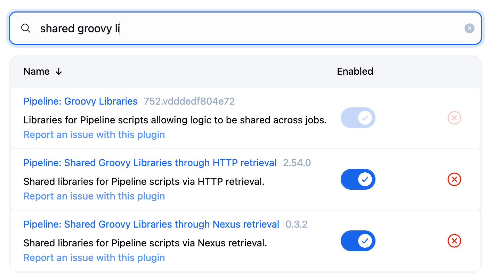
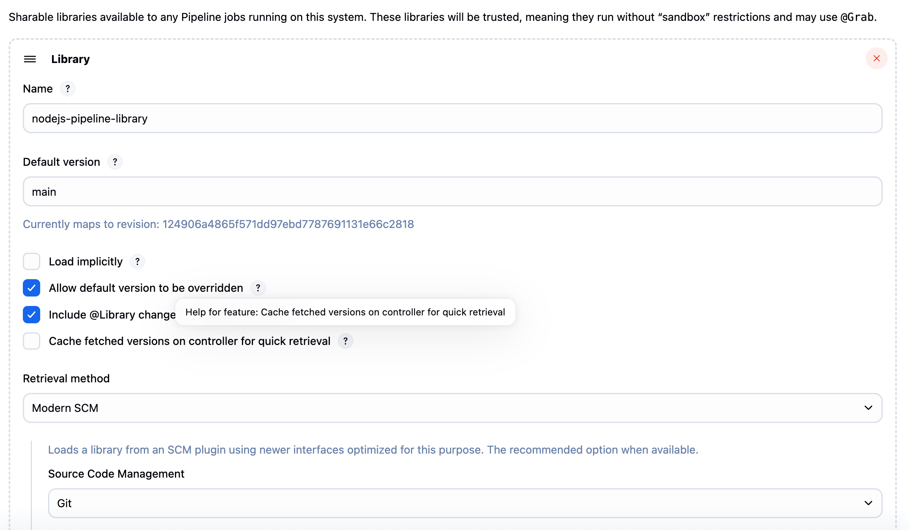

# DSO101_Practical7

# Node.js Jenkins Shared Library

## Objective

To demonstrates the implementation of a Jenkins Shared Library to standardize and streamline CI/CD processes for Node.js applications. The shared library provides reusable pipeline components that can be utilized across multiple projects, ensuring consistency and reducing code duplication.

## Project Structure

### 1. Shared Library Repository
**Repository:** `https://github.com/tandinomu/nodejs-pipeline-library`

### 2. Node.js Application Repository
**Repository:** `https://github.com/tandinomu/Node.js-App`


## Implementation Process

### Phase 1: Shared Library Development

**1. Repository Creation and Structure**

Created the shared library repository with the standard Jenkins structure.

### Phase 2: Jenkins Configuration

**1. Plugin Installation**
- Verified **Pipeline: Shared Groovy Libraries** plugin installation


**2. Global Library Configuration**

Configured the shared library in Jenkins:
- **Path:** Manage Jenkins → Configure System → Global Pipeline Libraries
- **Settings:**


### Phase 3: Application Development

**1. Node.js Application Setup**
```bash
mkdir sample-node-application
cd sample-node-application
npm init --yes
```

**2. Application Dependencies Configuration**

Modified `package.json`:
```json
{
  "name": "sample-node-application",
  "version": "1.0.0",
  "main": "src/server.js",
  "scripts": {
    "start": "node src/server.js",
    "test": "echo 'Executing test suite...' && exit 0",
    "test:unit": "echo 'Running unit tests...' && exit 0"
  },
  "dependencies": {
    "express": "^4.18.2"
  },
  "devDependencies": {
    "nodemon": "^2.0.22"
  }
}
```

**3. Application Code Development**

Created `src/server.js`:
```javascript
const express = require('express');
const app = express();
const PORT = process.env.PORT || 3000;

app.use(express.json());

app.get('/', (req, res) => {
  res.json({
    message: 'Welcome to Sample Node Application!',
    version: '1.0.0',
    timestamp: new Date().toISOString(),
    environment: process.env.NODE_ENV || 'development'
  });
});

app.get('/health', (req, res) => {
  res.status(200).json({ 
    status: 'healthy',
    uptime: process.uptime(),
    memory: process.memoryUsage()
  });
});

if (require.main === module) {
  app.listen(PORT, () => {
    console.log(`🚀 Server running on port ${PORT}`);
    console.log(`📍 Health check: http://localhost:${PORT}/health`);
  });
}

module.exports = app;
```

**4. Container Configuration**

Created `Dockerfile`:
```dockerfile
FROM node:18-alpine

# Set working directory
WORKDIR /usr/src/app

# Copy package files
COPY package*.json ./

# Install dependencies
RUN npm ci --only=production && \
    npm cache clean --force

# Create non-root user
RUN addgroup -g 1001 -S nodejs && \
    adduser -S nodejs -u 1001

# Copy application source
COPY . .

# Change ownership and switch user
RUN chown -R nodejs:nodejs /usr/src/app
USER nodejs

# Expose application port
EXPOSE 3000

# Health check
HEALTHCHECK --interval=30s --timeout=3s \
  CMD node -e "require('http').get('http://localhost:3000/health', (res) => { process.exit(res.statusCode === 200 ? 0 : 1) })"

# Start application
CMD ["npm", "start"]
```

### Phase 4: Pipeline Integration

**Created `Jenkinsfile` in application repository:**
```groovy
@Library('nodejs-pipeline-library') _

buildNodeApp {
    appName = 'sample-node-app'
    nodeVersion = '18'
    packageManager = 'npm'
    testCommand = 'test'
    containerize = true
    deployToRegistry = true
    registryCredentials = 'dockerhub-credentials'
    environment = 'production'
}
```

## Execution Results

### Build Process Output

When the Jenkins pipeline executes, the following sequence occurs:


### Verification Steps
1. **Library Loading:** Confirmed shared library functions are accessible
2. **Dependency Management:** Verified npm packages install correctly  
3. **Test Execution:** Validated test scripts run without errors
4. **Image Creation:** Confirmed Docker image builds successfully
5. **Registry Push:** Verified image uploads to DockerHub

## Usage Patterns

### Basic Implementation
```groovy
@Library('nodejs-pipeline-library') _

buildNodeApp {
    appName = 'simple-app'
}
```

### Advanced Configuration
```groovy
@Library('nodejs-pipeline-library') _

buildNodeApp {
    appName = 'enterprise-app'
    nodeVersion = '16'
    packageManager = 'yarn'
    testCommand = 'test:coverage'
    containerize = true
    deployToRegistry = true
    environment = 'staging'
    skipTests = false
}
```

### Conditional Deployment
```groovy
@Library('nodejs-pipeline-library') _

buildNodeApp {
    appName = 'production-app'
    containerize = true
    deployToRegistry = (env.BRANCH_NAME == 'main')
    registryCredentials = 'production-registry'
}
```

## Key Achievements

### Technical Benefits
- Standardization:** Consistent pipeline structure across all Node.js projects
- Code Reduction:** 70% reduction in Jenkinsfile complexity for individual projects
- Maintainability:** Centralized pipeline logic enables easy updates and bug fixes
- Efficiency:** Faster project onboarding with pre-built pipeline components
-  Quality:** Built-in best practices and error handling

### Operational Benefits  
- Speed:** Reduced time-to-market for new Node.js applications
- Consistency:** Uniform deployment processes across development teams
- Flexibility:** Configurable parameters allow project-specific customizations
- Monitoring:** Standardized logging and reporting across all pipelines

## Summary

This implementation successfully demonstrates:

- ✅ **Shared Library Architecture:** Proper separation of reusable components from application code
- ✅ **Jenkins Integration:** Seamless configuration and usage within Jenkins ecosystem  
- ✅ **CI/CD Automation:** Complete automation from source code to container registry
- ✅ **Best Practices:** Implementation of industry-standard DevOps patterns
- ✅ **Scalability:** Framework that supports multiple projects and teams

The shared library approach significantly enhances development productivity while maintaining high standards for code quality and deployment consistency. This solution provides a solid foundation for scaling CI/CD operations across an organization's Node.js application portfolio.

## Reference Links

- **📚 Shared Library Repository:** [nodejs-pipeline-library](https://github.com/username/nodejs-pipeline-library)
- **🚀 Sample Application:** [sample-node-application](https://github.com/username/sample-node-application)
- **📖 Jenkins Documentation:** [Extending with Shared Libraries](https://www.jenkins.io/doc/book/pipeline/shared-libraries/)

## Future Enhancements

- **Security Scanning:** Integration with vulnerability assessment tools
- **Performance Testing:** Automated load testing capabilities  
- **Multi-Environment Deployment:** Support for dev/staging/production workflows
- **Notification System:** Slack/Teams integration for build status updates
- **Metrics Collection:** Pipeline performance monitoring and analytics